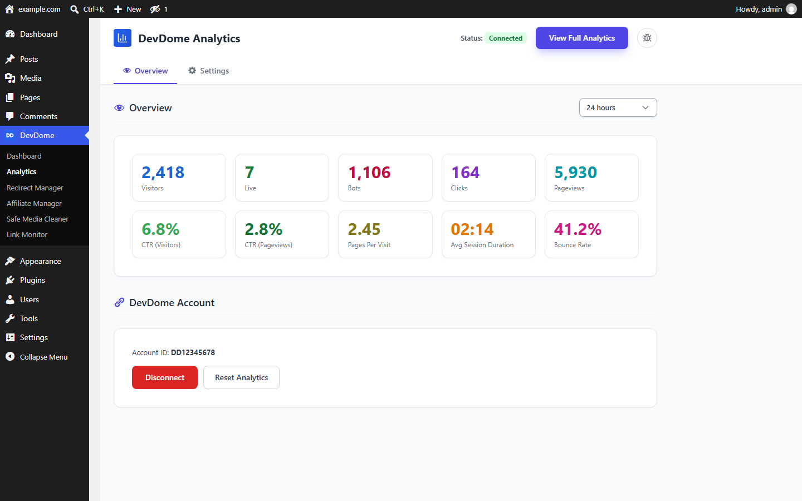
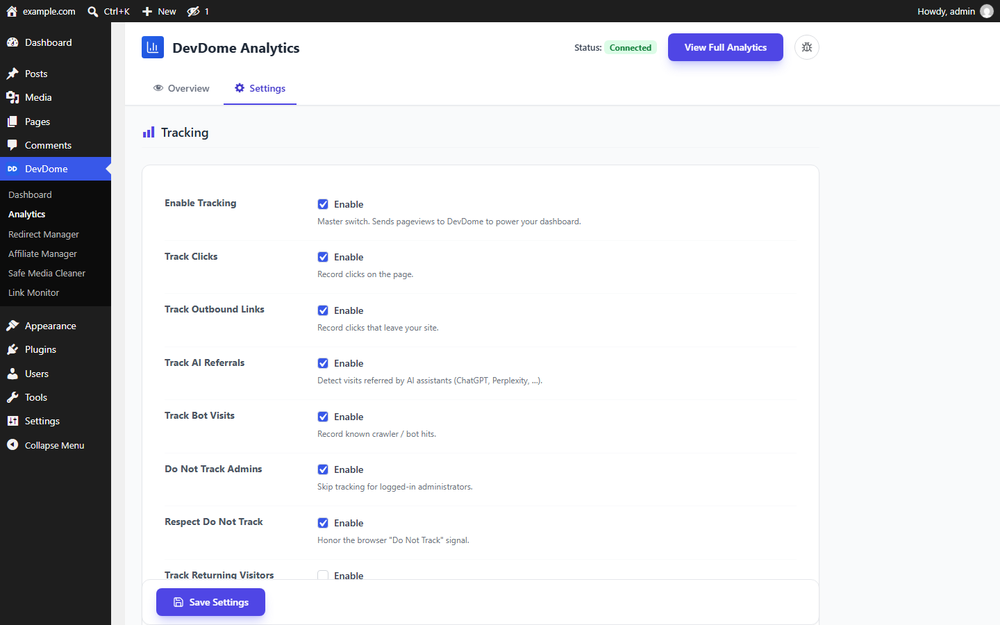
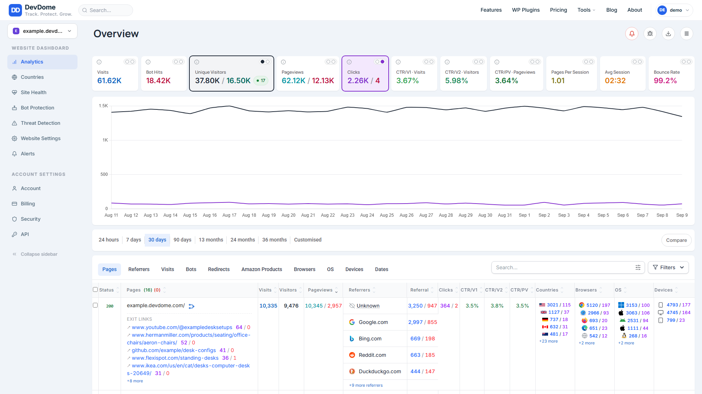
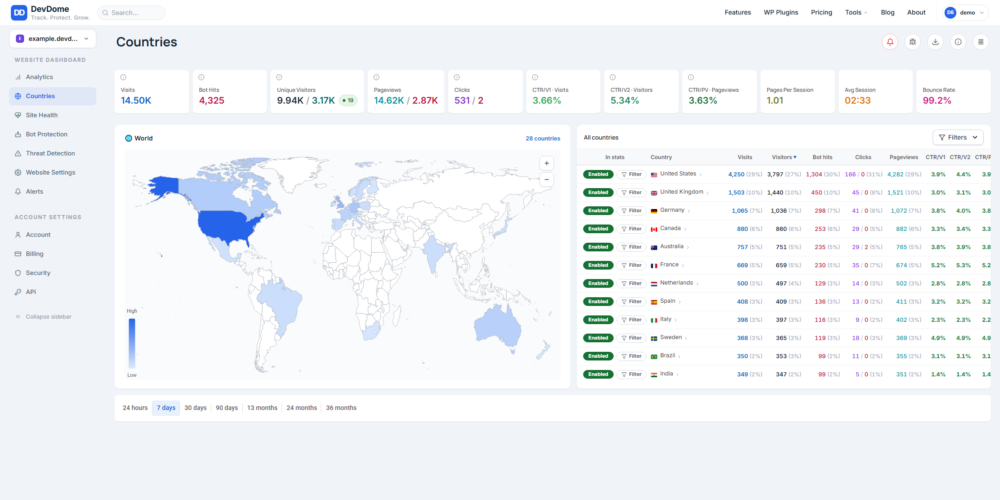
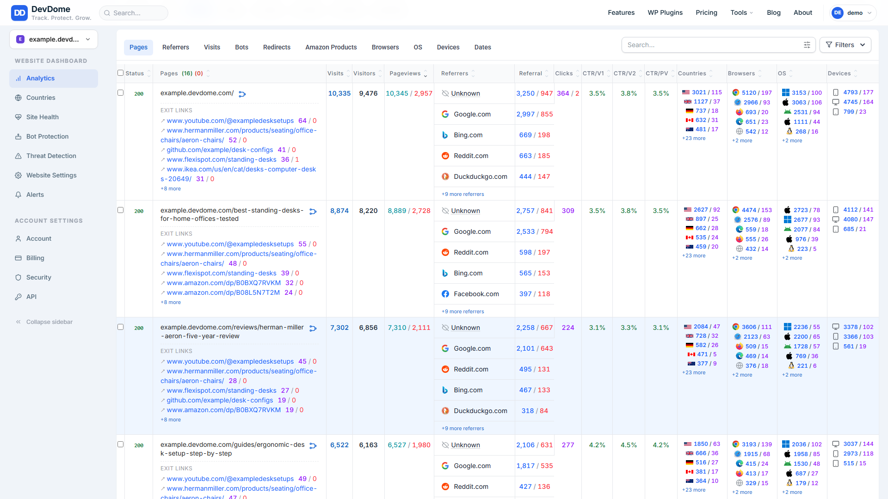
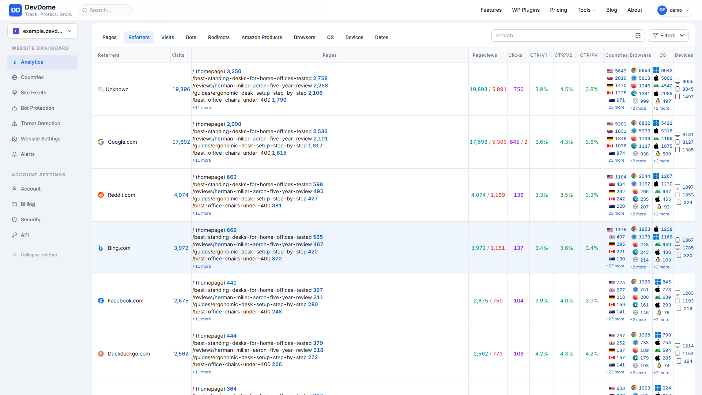
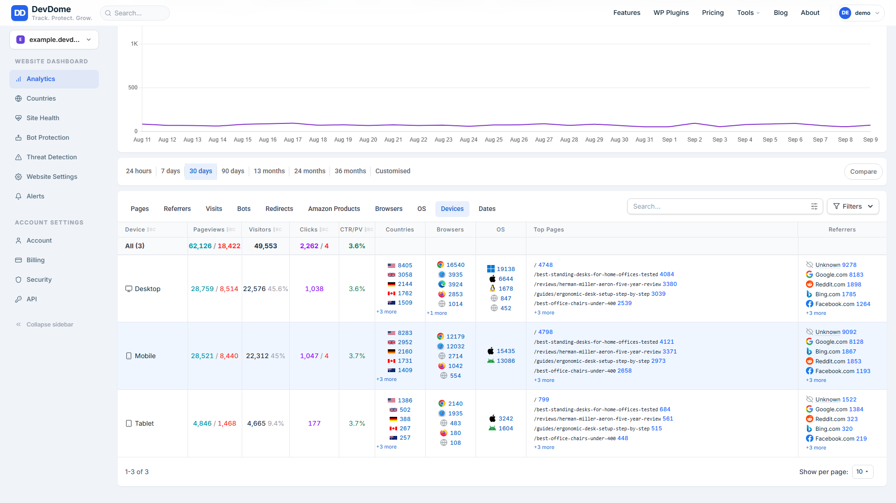

# DevDome Analytics - free cookieless WordPress analytics with bot and AI crawler detection

**The free alternative to Plausible, Fathom, Matomo, MonsterInsights, Google Analytics and Jetpack Stats for WordPress.**
Real-time visitor statistics, pageviews, sessions, traffic sources, countries, devices and outbound clicks, with
human visitors counted separately from bots and AI crawlers (GPTBot, ClaudeBot, PerplexityBot and 100+ more).
Cookieless, no consent banner needed, nothing stored in your WordPress database.

- **Install from WordPress.org:** https://wordpress.org/plugins/devdome-analytics/
- **Website and dashboard:** https://devdome.com
- **Support:** https://wordpress.org/support/plugin/devdome-analytics/

## Why DevDome Analytics instead of the alternatives

| | DevDome Analytics | Plausible | Fathom | Matomo (self-hosted) | MonsterInsights | Google Analytics 4 |
|---|---|---|---|---|---|---|
| Price | **Free** | from $9 / month | from $15 / month | Free, your own server | Pro from $199.50 / year | Free |
| Cookieless, no consent banner | Yes | Yes | Yes | Configurable | No (GA cookies) | No |
| Bots and AI crawlers counted separately | **Yes** | No | No | Bots filtered, not shown | No | No |
| AI referral traffic (ChatGPT, Perplexity) | Yes | Partial | No | No | No | Manual setup |
| Outbound click tracking | Yes | Yes | Yes | Yes | Yes | Yes |
| Stats inside wp-admin | Yes | Widget | No | No | Yes | Yes |
| Data in your WordPress database | None | None | Your server | Your server | None | None |
| Public Stats API + MCP server | **Yes** | API (paid) | API | API | No | API |
| Site limit | None | Per plan | Per plan | None | Per licence | None |

Prices are the vendors' entry plans as published in September 2026.

## Ask your analytics a question: Stats API and MCP server

DevDome Analytics ships a public Stats API and an MCP server, so Claude, ChatGPT, Cursor or any MCP client can
answer questions like "how many real people visited yesterday", "which AI crawlers hit the site this week" or
"top referrers for the last 30 days" straight from your data.

- MCP endpoint: `https://analytics.devdome.com/mcp`
- Registry entry: `com.devdome/analytics` in the official MCP registry
- MCP server repository: https://github.com/DevDomeFamily/devdome-mcp

## Features

- **Real-time analytics.** Visitors, live visitors, pageviews, sessions, top pages, traffic sources and referrers,
  countries, devices, browsers, outbound link clicks.
- **Human, bot and AI crawler split.** Known bots and AI crawlers are detected and reported separately, so
  automated traffic never inflates your visitor numbers. AI referral visits are tracked too.
- **Cookieless and GDPR-friendly.** No cookies, no personal data stored, Do Not Track honoured, admins excluded.
- **Lightweight.** One small tracker, no analytics tables in your WordPress database.
- **Dashboard.** Key numbers inside wp-admin, full reports on the DevDome dashboard from 24 hours to 36 months.
- **Stats API and MCP server** for your own tools and AI assistants.

## Screenshots

*Inside WordPress: the plugin's overview tab.*

*Plugin settings.*

*Dashboard: visits, unique visitors, pageviews, clicks and bot hits, humans and bots side by side, with the pages table.*

*Countries: map and per-country numbers.*

*Pages: everything per page, including outbound clicks.*

*Referrers: where human traffic comes from.*

*Devices: desktop, mobile and tablet broken down.*

## Requirements

WordPress 6.0+, PHP 7.4+, a free DevDome account (the plugin is the connector for the DevDome Analytics service).

## Installation

1. In wp-admin go to **Plugins > Add New**, search for **DevDome Analytics**, install and activate.
2. Open **DevDome > Analytics** and connect your free DevDome account.
3. Statistics start within minutes, inside wp-admin and on the DevDome dashboard.

## Part of the DevDome plugin family

Free WordPress plugins by [DevDome](https://devdome.com): Analytics, Redirect Manager, Media Cleaner, Link Monitor,
Affiliate Manager. Every plugin ships with the DevDome Dashboard inside wp-admin, so the others install in one click.

## Development

This repository mirrors the release published on WordPress.org. Bug reports and feature requests: open an issue here
or use the [support forum](https://wordpress.org/support/plugin/devdome-analytics/).

## License

GPL-2.0 or later. See [LICENSE](LICENSE).
